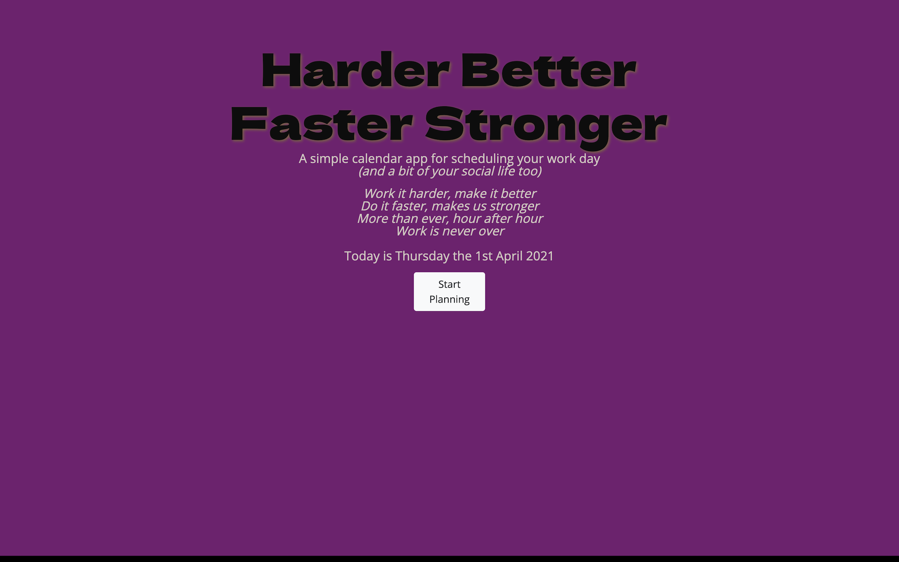
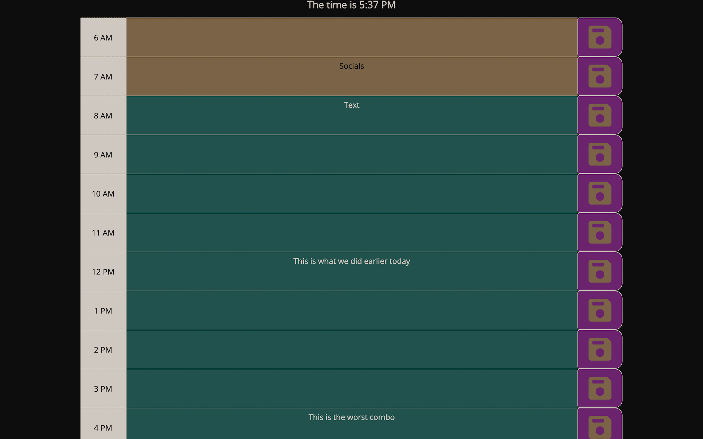

# 05-HW-WorkDayPlanner

## Description
Our client is looking for a way to efficiently manage their employees work time by providing them with an app to plan out their work day hour by hour.

## Criteria
- Current day is displayed at the top of the planner
- Timeblocks displayed for standard business hours
- Timeblocks are color coded for past, present or future
- Timeblock allows for event entry
- Event saves in Timeblock & localStorage on button click

## Deployment
https://mrsamlaw.github.io/05-HW-WorkDayPlanner/

## Screenshots

## Psuedo Code
- Moment.js for current day & time
- Bootstrap Rows & columns for time block & save button
- Moment.js for current hour & compare for color coding time blocks
- Task Object stored in an array for time & Task [Extend with date]
- localStorage to get/set tasks

## Inspiration
The color styling was inspired by this image from this image: Harder, Better, Faster, Stronger by artist Roger Aquino C (https://dribbble.com/roger_aquinoc).  

Floppy Disk Icons made by <a href="https://www.flaticon.com/authors/pixel-perfect" title="Pixel perfect">Pixel perfect</a> from <a href="https://www.flaticon.com/" title="Flaticon">www.flaticon.com</a>
